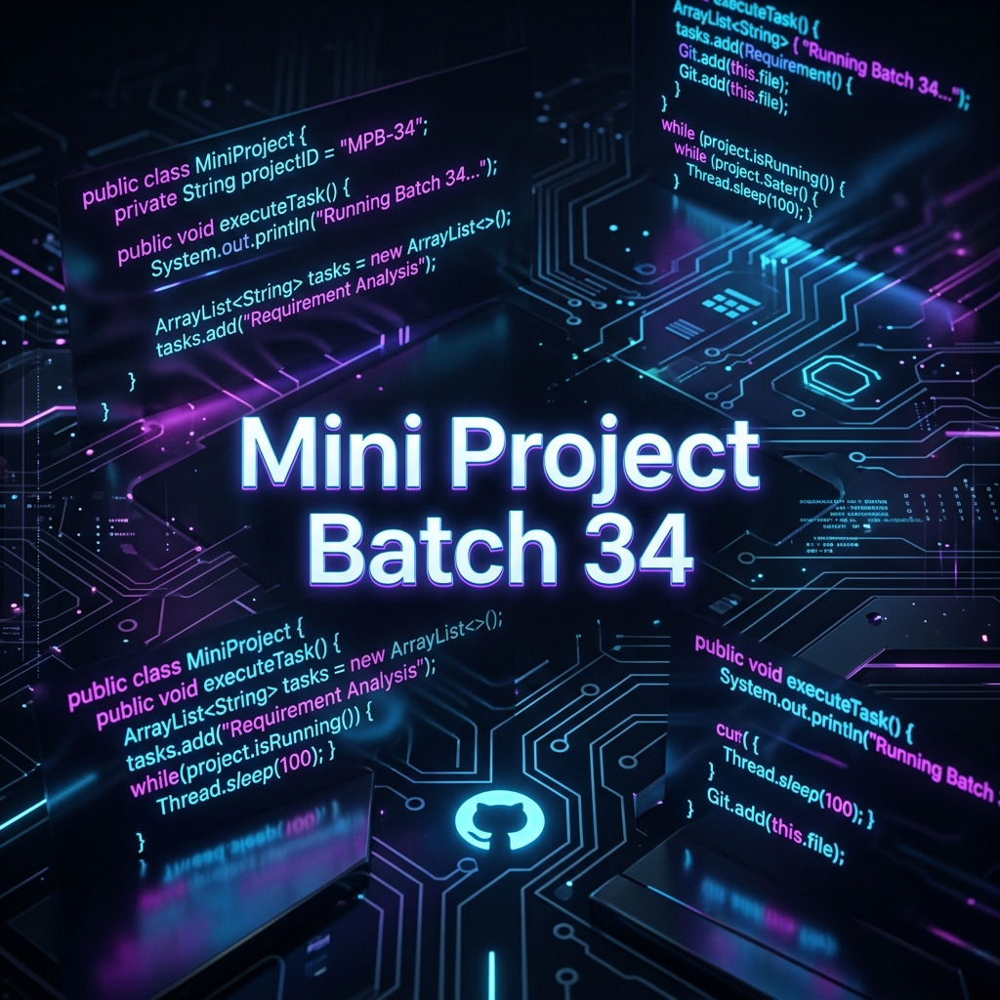

<p align="center">
  
</p>

<h1 align="center">✨ Java Mini Projects - Batch 34 ✨</h1>

<p align="center">
  <b>A premium collection of Java Console Applications demonstrating OOP mastery, collections, and robust File I/O.</b><br><br>
  
  
  
</p>

---

## 🚀 Overview

Welcome to the **Mini Projects - Batch 34** repository! This project contains two meticulously crafted Java command-line interface (CLI) applications designed for simplicity, user-friendliness, and reliability. 

🔹 **ATM Simulation System**: A virtual banking console allowing seamless money transactions.  
🔹 **Employee Management System**: A full-featured CRUD system to organize HR records efficiently with persistent storage.  

---

## 🏦 1. ATM Simulation System

A powerful, secure, and user-friendly virtual Automatic Teller Machine.

### ✨ Features
- 🔐 **Secure Authentication**: Validates user credentials natively.
- 💳 **Real-time Balance Check**: Ensures your numbers are always up to date.
- 💰 **Deposit & Withdraw Options**: Seamlessly update available funds.
- 📜 **Detailed Transaction Ledger**: Complete history track of user activities.

<br>

### 📸 Output Screenshot Preview 
*(Terminal Output Representation)*

> ```console
> ===== ATM SYSTEM =====
> Enter Account Number: 1001
> Enter PIN: 1234
> Login successful!
> 
> 1. Check Balance
> 2. Deposit
> 3. Withdraw
> 4. Transaction History
> 5. Exit
> Enter choice: 2
> Enter amount: 1500
> Deposit successful!
> ```

---

## 👨‍💼 2. Employee Management System

An advanced HR solution operating right from your terminal, built with robust Java concepts like Streams, Lambdas, and Serialization.

### ✨ Features
- ⚡ **Full CRUD Capabilities**: Add, View, Update, and Remove personnel.
- 🔍 **Smart Search & Sort**: Query by department or instantly sort entries by their compensation package utilizing Java 8 features.
- 💾 **Persistent Data Storage**: Intelligent save-state via `employees.dat` file serialization, so you never lose your data when the app closes.
- 📑 **One-Click CSV Export**: Convert your personnel database into `.csv` format seamlessly!
- 🛡️ **Exception Handling**: Completely crash-proof with custom `InvalidEmployeeDataException` guards.

<br>

### 📸 Output Screenshot Preview
*(Terminal Output Representation)*

> ```console
> ==================================================
>           EMPLOYEE MANAGEMENT SYSTEM
> ==================================================
> 1. Add Employee
> 2. View All Employees
> 3. Search by Department
> 4. Sort by Salary
> 5. Update Employee
> 6. Delete Employee
> 7. Export to CSV
> 8. Exit
> ==================================================
> Enter your choice: 2
> 
> --- All Employees (2) ---
> ID: E101     | Name: John Doe        | Dept: IT           | Salary: ₹85,000.00
> ID: E102     | Name: Jane Smith      | Dept: HR           | Salary: ₹76,000.00
> ```

---

## 🛠️ Installation & Usage

No complicated setup required! Running these applications is lightning fast.

### Prerequisites
- Make sure [Java Development Kit (JDK)](https://www.oracle.com/java/technologies/downloads/) is installed on your machine.

### Running the ATM System
```bash
git clone https://github.com/GOPID1603/Mini-project-Batch-34.git
cd Mini-project-Batch-34
javac -d . ATM.java Account.java Transaction.java
java mini.project.ATM
```

### Running the Employee Management System
```bash
git clone https://github.com/GOPID1603/Mini-project-Batch-34.git
cd Mini-project-Batch-34
javac -d . EmployeeManagementSystem.java
java mini.project2.EmployeeManagementSystem
```

---

## 📈 Future Enhancements / Roadmap
* 🌟 **Database Integration:** Move from `.dat` file persistence to MySQL/Postgres.
* 🌟 **Graphical User Interface:** Wrap the backend logic in JavaFX or Spring Boot.
* 🌟 **Multi-Threading:** Allow multiple concurrent employees to edit HR records.
* 🌟 **Role-Based Access:** Limit HR functionalities by user tier.

---
<p align="center">
  <i>Developed with ❤️ for Batch 34.</i>
</p>
